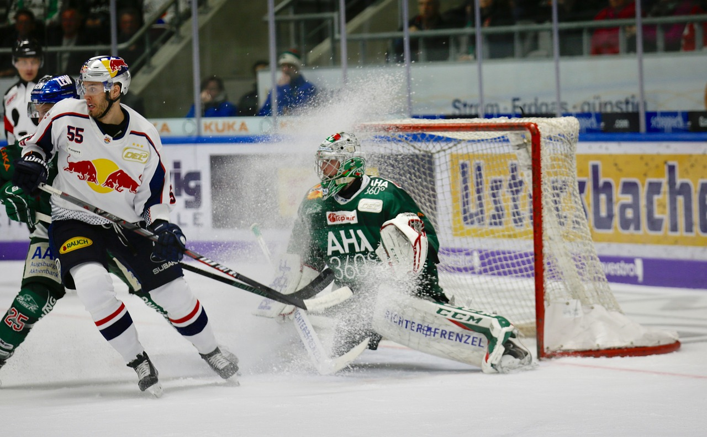

# Group 10 - Analyzing NHL Predictions

## Milestones

  
- Milestone 1 ✔
- Milestone 2 ✔
- Milestone 3 ✔
- Milestone 4 ✔
- Milestone 5

## Describe your topic/interest in about 150-200 words
  

Our topic at its broadest is simply "hockey," but that's not a very helpful description. More specifically, we're interested in analyzing a few trends in National Hockey League games that we feel may (or demonstrably *do*) have an effect on the outcomes of games -- home ice advantage, travel time, and the effect of intra-divisional matchups on the total score of a game. Sports as a source of data isn't entirely new; baseball is perhaps most famous for fans' obsessive tracking and analysis of game data. But hockey is equally valuable for data analysis, and at any rate it interests our group much more than baseball. In our analytics project, we hope to show whether travel time had any significant impact on teams' records last season, as well as potentially reconfirming the value of a "home advantage." Seeing the potential effect of divisional matchups on games is an interesting topic to us as well, as the four-point swing in a playoff race is often said to incentivize teams to push harder and possibly score higher. A dashboard could absolutely be built for this -- while some (e.g. home ice advantage) may not be especially interesting to look at in a dashboard, visualizations for the "net change in win rate, by distance from home city" could drive a lot of interest.

## Describe your dataset in about 150-200 words

This data set was provided by FiveThirtyEight and is a forecast of the 2021-2022 NHL season. While they have a data set with every game since the inaugural season in 1917-1918, we chose last year’s data as it would have both predicted and actual outcomes of games. The data set gives each team a rating and tries to predict the outcome of the rest of the season based on thousands of simulated games. Throughout the season with each actual game played, the ratings of each team are updated and the simulation process is repeated. It is hard to know FiveThirtyEight’s purpose for the data set beyond an initial article, but they have prediction models for almost every sport that are all very reputable. The data set only requires the scores of each game and if they went into overtime/shootout to calculate the ratings. A little fun fact, NHL data is collected by a team of “scorers” at each stadium who keep track of every possible game time stat.

Supplementary data for the distance between NHL cities has been provided by deep13.xyz. The data set, very simply, is a 32-by-32 table containing the distances between each NHL city and each of the others, in kilometers. The distance is "as the crow flies," based on the geographic coordinates of each NHL arena. The source itself states that the coordinates are "according to the internet, which is never wrong," which raises some slight concerns about the authenticity of the data; however, randomly chosen pairs of cities have accurate distances according to a Google Maps check.

Supplementary data for the average NHL attendance has been provided by statista.com with the original data coming from ESPN.com in July of 2022. The data shows average attendance of every NHL team for the 2021-2022 season.

## Team Members

- Jordan Colledge: A fourth-year computer science major and writer, who knows his optimism for the 2022-23 Vancouver Canucks is probably misplaced.
- Jake Daongam: Fourth year computer science student and Habs fan praying for another miracle.
- Andrei Zipis: Third year computer science student who hopes the Canucks will win a Stanley cup in his lifetime!

## Images

{You can use this area for any images you want to include}

## References

**Please remember to update this section**

{Add your credits, acknowledgements, references, or citations **including a link to the data source** here}

Data Source: https://projects.fivethirtyeight.com/nhl-api/nhl_elo_latest.csv

Image Sources:  

- ice_hockey1: https://pixabay.com/photos/ice-hockey-sports-puck-game-4381206/  License: Pixabay License

NOTE: At time of writing, the above data source still contains information on the 2021-22 season. However, in the future it's expected to be replaced with the FiveThirtyEight predictions for the 2022-23 season. After that time, the data used for this will need to be extracted from the following link:

https://projects.fivethirtyeight.com/nhl-api/nhl_elo.csv

NHL City Distance Data Source: https://www.deep13.xyz/nhldistance

NHL Average Attendance Data Source: https://www.statista.com/statistics/193749/regular-season-home-attendance-of-national-hockey-league-teams-in-2010/

NOTE: The data from this page was simply copy-and-pasted into Microsoft Excel, then saved as a CSV file.
