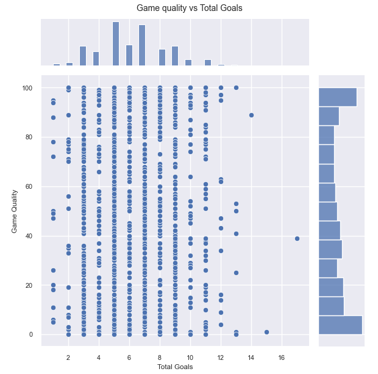

# Group 10 - Analyzing NHL Predictions

## Introduction

### Description of our topic

Our topic at its broadest is simply "hockey," but that's not a very helpful description. More specifically, we're interested in analyzing a few trends in National Hockey League games that we feel may (or demonstrably *do*) have an effect on the outcomes of games -- home ice advantage, travel time, and the effect of intra-divisional matchups on the total score of a game. Sports as a source of data isn't entirely new; baseball is perhaps most famous for fans' obsessive tracking and analysis of game data. But hockey is equally valuable for data analysis, and at any rate it interests our group much more than baseball. In our analytics project, we hope to show whether travel time had any significant impact on teams' records last season, as well as potentially reconfirming the value of a "home advantage." Seeing the potential effect of divisional matchups on games is an interesting topic to us as well, as the four-point swing in a playoff race is often said to incentivize teams to push harder and possibly score higher. A dashboard could absolutely be built for this -- while some (e.g. home ice advantage) may not be especially interesting to look at in a dashboard, visualizations for the "net change in win rate, by distance from home city" could drive a lot of interest.

### Description of dataset

This data set was provided by FiveThirtyEight and is a forecast of the 2021-2022 NHL season. While they have a data set with every game since the inaugural season in 1917-1918, we chose last year’s data as it would have both predicted and actual outcomes of games. The data set gives each team a rating and tries to predict the outcome of the rest of the season based on thousands of simulated games. Throughout the season with each actual game played, the ratings of each team are updated and the simulation process is repeated. It is hard to know FiveThirtyEight’s purpose for the data set beyond an initial article, but they have prediction models for almost every sport that are all very reputable. The data set only requires the scores of each game and if they went into overtime/shootout to calculate the ratings. A little fun fact, NHL data is collected by a team of “scorers” at each stadium who keep track of every possible game time stat.

Supplementary data for the distance between NHL cities has been provided by deep13.xyz. The data set, very simply, is a 32-by-32 table containing the distances between each NHL city and each of the others, in kilometers. The distance is "as the crow flies," based on the geographic coordinates of each NHL arena. The source itself states that the coordinates are "according to the internet, which is never wrong," which raises some slight concerns about the authenticity of the data; however, randomly chosen pairs of cities have accurate distances according to a Google Maps check.

Supplementary data for the average NHL attendance has been provided by statista.com with the original data coming from ESPN.com in July of 2022. The data shows average attendance of every NHL team for the 2021-2022 season.

## Exploratory Data Analysis

We conducted an EDA by creating the correlation plot comparing the columns against eachother. This helped us identify all of the columns in the dataset, as well as helping us identify if there were any interesting correlations between them!

There are a few interesting trends that appear in the correlation map. The obvious ones are that home and away ratings are positively correlated with the corresponding win probabilities, also that ratings are loosely correlated to the points they will score. The interesting one I found was that the overtime probability was posititely correlated with the away team's win probability! Game importance which is a score on how much the result will affect playoff odds is interesting since it doesnt seem to be correlated to any other column, so 538 must have more data that they aren't sharing!

To visualize the correlation between overtime probability and team's win probability, I decided to graph them on a scatterplot

While the overtime probability is directly correlated to the ratings, it's interesting to see that the highest probability of overtime occurs when the home team has a ~50 point disadvantage to the away team! I assume this is because being the home team gives an advantage, so this helps us see that the advantage is around 50 points. 

Following the previous scatterplot, I wanted to see if my conclusion that teams with a -50 rating differential had the most overtimes. To check, I plotted the amount of times teams went into either overtime or a shootout in the regular season. 

Chicago, Detroit, Minnesota and Tampa were leading the count! The first two make sense as they were average to below average teams during the 2021 season, but Minnesota and Tampa were both top 3 in their division. Very interesting

One last thing I wanted to see was how the rating difference changed throughout the season. I visualized this using a lineplot.

This graph is interesting to delve into, since the 538 algorithm works by setting most of the teams around the same rating at the start of the year with a little deviation in ratings based on the previous year. As the year goes on, teams start to deviate from the mean as good teams keep gaining points from winning and bad teams continually lose points from losing games. An interesting question that is brought up in this graph that is covered in Andrei's notebook is "when in the season can we have confidence in the predictions?"

## Jordan Colledge's Research Questions
---

// to do

## Jake Daongam's Research Questions
---

// to do

## Andrei Zipis' Research Questions
---

The questions that I was interested in answering revolved around things that fans have heard said in the media or from team employees. Common phrases include: "American thanksgiving is a good barometer for the season", "the team will do better when they return home" and, "that game was a nailbiter".

#### [Link to Notebook](https://github.com/ubco-W2022T1-cosc301/project-group10/blob/main/notebooks/analysis3.ipynb)

### 1. Can you accurately predict end of season standings from the first 20 games?

This graph shows every NHL teams position in the standings at the 20 game mark of the season (which loosely coincides with American Thanksgiving) and the end of the season at the 82nd game mark. At first glance it appears that there are many lines crossing each other which would imply many changes in position. However if you follow a team from start to finish, you'll notice that the change is not that significant. This is more visibile in the following boxplot.

The max change in standings was +/- 10 spots and these are considered outliers in the above plot. The interquartile range was 4.25 with a 1st quartile of -2 and a 3rd quartile of 2.25. This tells us that the bulk of teams moved up or down in the standings about 2 spots. Furthermore the standard deviation of 5 tells us that 68% of teams moved up or down at most 5 spots. Considering that there are 32 teams in the NHL, unless you are hovering around 16th place (the playoff bar), it is rare that there will be a significant change from the 20th game to the 82nd. As a result, it appears that the 20 game mark is a fantastic predictor of where a team will end up at the end of the season.

### 2. Do 538's Game Quality scores accurately represent what humans perceive to be a quality game?

In my opinion, a quality NHL game can involve one or more of the following:

- above average number of goals
- a small goal differential
- a higher game number (meaning it is closer to the playoffs and teams would be competing harder for points)
- involves good teams (highly rated)

The above heatmap has been adjusted to include derived values "total goals" and "score closeness" to determine if there is any correlation with game quality. However, only team ratings and attendance seem to have a strong correlation with 538's "Game Quality Rating".
As a result, I would say that the game quality rating isn't really accurate to what a human would perceive. We will check total goals and score closeness vs. game quality to better see whether there is any relationship.

I would have expected higher total goals to result in a higher game quality. Coincidentally I would have thought that a game with a closer final score would have also resulted in a higher game quality. Neither of those things appear to be true. Ultimately it seems that 538's Game Quality Rating is mostly based on whether the 2 teams playing have high ratings and are therefore "good" teams.

The caveat to this being when the visualization is filtered by games with a game quality of 90-100. These games had resulted in far closer scores (within 1.6 goals) than the average. Another interesting finding is that of the 14 teams that had games with a quality score of 90-100, only the Vegas Golden Knights missed the playoffs. Ultimately it appears that 538's "Game Quality" score is able to accurately predict the games which include the top teams in the NHL. However, it does not seem able to predict whether the game will be high scoring or a "nailbiter".

### 3. Does a higher fan attendance result in a higher home advantage vs. lower?

The above plot appears to have a positive regression line implying that higher attendance results in a better home team score differential (positive score differential = win, negative = loss). However, it must also be considered that better teams are likely to have a higher attendance than worse teams, this may play a part in the increase in home performance. On average, home teams are likely to have 0.25 more goals than road teams. This shows that a home team advantage definitely exists in the NHL but it may be hard to discern how much of an effect attendance has on it.

The above plot is filtered by the 16 teams that made the playoffs in 2022. It shows that as the home attendance goes up, the score differential increases into the positives.

## Summary
---
- The 20 game marks is a good predictor of end of season standings as two-thirds (2/3) of teams are likely to find themselves within 5 positions (+/-) of that spot.
- 538's Game Quality score accurately predicts good teams but is unable to predict whether a specific game will be perceived as "good" by a human
- Teams with higher attendance win more, but it is difficult to determine how much of that impact is due to the fans. Better teams will attract more people to come watch.
